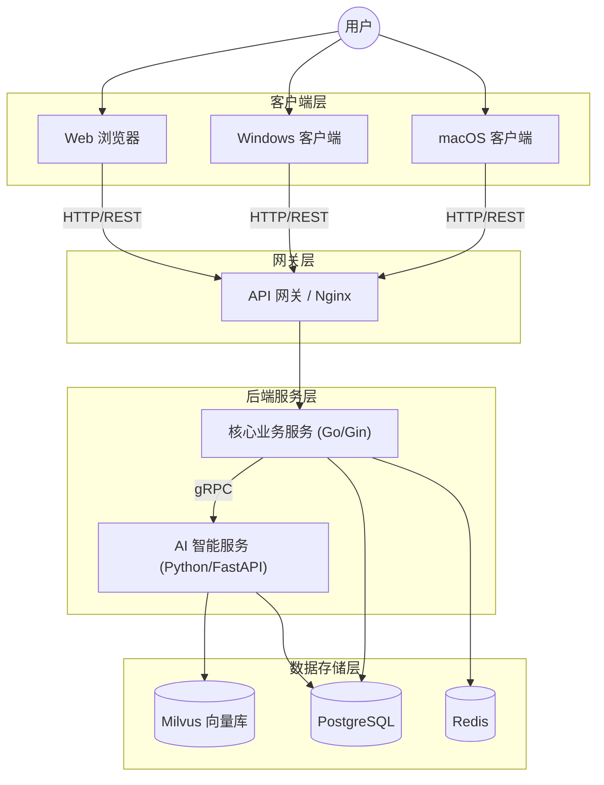

# NutriMate - 临床营养智能管理系统 (Clinical Nutrition Intelligent Management System)

> **您的专属营养智能伙伴 (Your Intelligent Nutrition Partner)**

NutriMate 是一款专为医疗机构临床营养科打造的院级智能管理平台。旨在通过 AI 技术赋能营养治疗全流程，提供从患者筛查评估、智能处方推荐、预包装膳食管理到个性化干预的一站式解决方案。

系统采用先进的 **CS + BS 混合架构**，兼顾 Web 端的便捷访问与桌面客户端的高性能交互体验。

---

## ✨ 核心特性

- **🧠 Mate AI 智能引擎**：基于大模型与知识库，自动解析医嘱，提供个性化营养处方推荐与风险预警。
- **💻 跨平台无缝体验**：一套代码覆盖 **Windows**、**macOS** 客户端与 **Web** 浏览器，满足不同场景办公需求。
- **🏥 专业级处方管理**：支持复杂的肠内/肠外营养计算、配制医嘱流转及全流程质量监控。
- **📊 科学评估体系**：内置多种标准营养筛查量表（NRS-2002, PG-SGA 等），自动生成专业评估报告。
- **🤝 高效团队协作**：打通医师、营养师与护理人员的信息壁垒，支持跨科室即时会诊。

---

## 🛠 技术架构与选型

NutriMate 采用 **高性能混合架构**，充分发挥各语言生态优势：

### 🖥️ 前端层 (Web + Desktop)

- **框架**：[Vue 3](https://vuejs.org/) + TypeScript + [Vite](https://vitejs.dev/)
- **UI 组件库**：[Element Plus](https://element-plus.org/) (全平台统一视觉)
- **桌面构建**：[Tauri 2.0](https://tauri.app/) (高性能、轻量级 WebView 渲染)
- **状态管理**：Pinia

### 🔙 服务端 (Microservices)

- **核心业务服务**：**Go** ([Gin](https://gin-gonic.com/) + GORM)
  - _职责_：高性能 API 网关、用户鉴权、医嘱流转业务、实时消息推送。
- **AI 智能服务**：**Python** ([FastAPI](https://fastapi.tiangolo.com/))
  - _职责_：LLM 接口封装、营养算法模型推理、知识库检索 (RAG)。
- **通信协议**：gRPC (内部服务间) / HTTP RESTful (前端交互)

### 💾 数据存储与基础设施

- **关系型数据库**：**PostgreSQL** (存储患者档案、处方记录等核心数据)
- **缓存中间件**：**Redis** (会话管理、高频数据缓存)
- **向量数据库**：**Milvus** (AI 知识库向量检索)

---

## 🏗️ 系统架构图



---

## 📂 项目目录结构 (Project Structure)

NutriMate 采用 Monorepo 风格组织代码，确保前后端与不同服务间的结构清晰且易于维护。

```text
NutriMate/
├── docs/                  # 项目文档 (需求、设计、API文档)
├── deploy/                # 容器化部署配置 (Docker Compose, K8s manifests)
├── backend/               # 后端服务群
│   ├── core-server/       # [Go] 核心业务服务 (用户、处方、医嘱)
│   │   ├── cmd/              # 程序入口
│   │   ├── internal/         # 内部业务逻辑 (Domain, Service, Repo)
│   │   └── pkg/              # 公共基础库
│   ├── ai-server/         # [Python] AI 智能服务 (RAG, 推理)
│   │   ├── app/              # FastAPI 应用源码
│   │   ├── models/           # 算法模型管理
│   │   └── vector_store/     # 向量库交互逻辑
│   └── proto/             # gRPC 协议定义 (.proto files)
├── frontend/              # 前端工程 (Vue 3 + Tauri)
│   ├──  src/               # Web 前端源码 (Vue components, stores)
│   └──  src-tauri/         # 桌面端外壳源码 (Rust配置与原生能力)
└──  README.md              # 项目主页与说明
```

---

## �🚀 快速开始

### 前置要求

- **Node.js** (v18+) & pnpm
- **Go** (v1.21+)
- **Python** (v3.10+)
- **Rust** (仅编译桌面端需要)
- **PostgreSQL**, **Redis** (本地或 Docker 运行)

### 1. 前端启动 (Web)

```bash
cd frontend
pnpm install
pnpm dev
# 访问 http://localhost:5173
```

### 2. 前端启动 (Desktop)

```bash
# 需确保 Rust 环境已安装
pnpm tauri dev
```

### 3. 后端服务启动

```bash
# 启动 Go 核心服务
cd backend/core-server
go run main.go

# 启动 AI 服务
cd backend/ai-server
pip install -r requirements.txt
uvicorn main:app --reload
```

---

## 📄 版权说明

本项目采用 [ GPL-2.0 License](LICENSE) 开源授权。
NutriMate © 2026 Tech Team.
